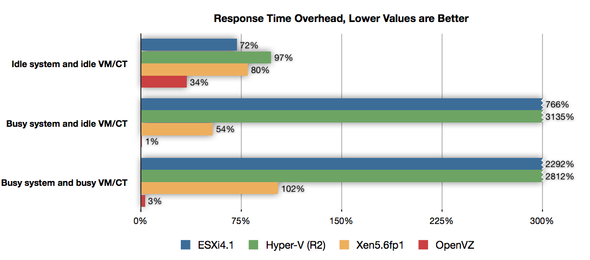
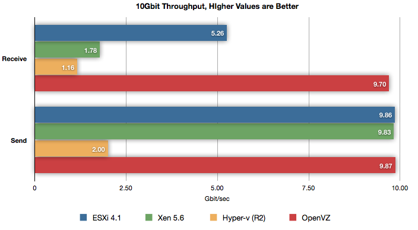

# Руководство по созданию и управлению контейнерами на базе Virtuozzo

<!--
## Определения
Снапшот (англ. snapshot) — снимок состояния виртуальной машины (ВМ) в определенный момент времени. Сюда входят настройки ВМ, содержимое памяти и дисков

Тонкий клиент (англ. thin client) — бездисковый компьютер-клиент в сетях с клиент-серверной или терминальной архитектурой, который переносит все или большую часть задач по обработке информации на сервер

Гипервизор (англ. hypervisor) — программа или аппаратная схема, позволяющая одновременное, параллельное выполнение нескольких ОС на одном и том же компьютере, обеспечивает изоляцию операционных систем друг от друга

Контейнер или VPS/VDS (англ. Virtual Private/Dedicated Server) — виртуальный выделенный сервер, эмулирует работу физического сервера

Оверхед (англ. overhead) — неизбежные накладные расходы
-->

## Содержание
* [Введение в виртуализацию](#Введение-в-виртуализацию)
  - [Эмуляция оборудования](#Эмуляция-оборудования)
  - [Полная виртуализация](#Полная-виртуализация)
  - [Паравиртуализация](#Паравиртуализация)
  - [Виртуализация уровня операционной системы](#Виртуализация-уровня операционной-системы)
  - [Virtuozzo — технология виртуализации уровня ОС](#Virtuozzo-—-технология-виртуализации-уровня-ОС)
* [Краткая история проекта Virtuozzo](#Краткая-история-проекта-Virtuozzo)

## Введение в виртуализацию
Виртуализация — предоставление наборов вычислительных ресурсов или их логического объединения, абстрагированное от аппаратной реализации, и обеспечивающее изоляцию вычислительных процессов.

Виртуализацию можно использовать в:
* консолидации серверов (позволяет мигрировать с физических серверов на виртуальные, тем самым увеличивается коэффициент использования аппаратуры, что позволяет существенно сэкономить на аппаратуре, электроэнергии и обслуживании)
* разработке и тестировании приложений (возможность одновременно запускать несколько различных ОС, это удобно при разработке кроссплатформенного ПО, тем самым значительно повышается качество, скорость разработки и тестирования приложений)
* бизнесе (использование виртуализации в бизнесе растет с каждым днем и постоянно находятся новые способы применения этой технологии, например, возможность безболезненно сделать снапшот)
* организации виртуальных рабочих станций (так называемых "тонких клиентов")

*Общая схема взаимодействия виртуализации с аппаратурой и программным обеспечением*

Понятие виртуализации можно условно разделить на две категории:
* виртуализация платформ, продуктом этого вида виртуализации являются виртуальные машины
* виртуализация ресурсов преследует целью комбинирование или упрощение представления аппаратных ресурсов для пользователя и получение неких пользовательских абстракций оборудования, пространств имен, сетей

Взаимодействие приложений и операционной системы (ОС) с аппаратным обеспечением осуществляется через абстрагированный слой виртуализации.

Существует несколько подходов организации виртуализации:
* эмуляция оборудования (QEMU, Bochs, Dynamips)
* полная виртуализация (KVM, HyperV, VirtualBox)
* паравиртуализация (Xen, L4, Trango)
* виртуализация уровня ОС (LXC, Virtuozzo, Jails, Solaris Zones)

### Эмуляция оборудования
Эмуляция аппаратных средств является одним из самых сложных методов виртуализации.
В то же время главной проблемой при эмуляции аппаратных средств является низкая скорость работы, в связи с тем, что каждая команда моделируется на основных аппаратных средствах.

В эмуляции оборудования используется механизм динамической трансляции, то есть каждая из инструкций эмулируемой платформы заменяется на заранее подготовленный фрагмент инструкций физического процессора.

Однако метод позволяет использовать виртуализированные аппаратные средства еще до выхода реальных.
Например, управление неизмененной ОС, предназначенной для PowerPC на системе с ARM процессором.

*Эмуляция оборудования моделирует аппаратные средства*

### Полная виртуализация
Полная виртуализация использует гипервизор, который осуществляет связь между гостевой ОС и аппаратными средствами физического сервера.
В связи с тем, что вся работа с гостевой операционной системой проходит через гипервизор, скорость работы данного типа виртуализации ниже чем в случае прямого взаимодействия с аппаратурой.
Основным преимуществом является то, что в ОС не вносятся никакие изменения, единственное ограничение — операционная система должна поддерживать основные аппаратные средства.

*Полная виртуализация использует гипервизор*

Полная виртуализация возможна исключительно при условии правильной комбинации оборудования и программного обеспечения.

### Паравиртуализация
Паравиртуализация имеет некоторые сходства с полной виртуализацией.
Этот метод использует гипервизор для разделения доступа к основным аппаратным средствам, но объединяет код, касающийся виртуализации, в непосредственно операционную систему, поэтому недостатком метода является то, что гостевая ОС должна быть изменена для гипервизора.
Но паравиртуализация существенно быстрее полной виртуализации, скорость работы виртуальной машины приближена к скорости реальной, это осуществляется за счет отсутствия эмуляции аппаратуры и учета существования гипервизора при выполнении системных вызовов в коде ядра.
Вместо привилегированных операций совершаются гипервызовы обращения ядра гостевой ОС к гипервизору с просьбой о выполнении операции.

*Паравиртуализация разделяет процесс с гостевой ОС*

В паравиртуальном режиме (PV) оборудование не эмулируется, и гостевая операционная система должна быть специальным образом модифицирована для работы в таком окружении.
Начиная с версии 3.0, ядро Linux поддерживает запуск в паравиртуальном режиме без перекомпиляции со сторонними патчами.
Преимущество режима паравиртуализации состоит в том, что он не требует поддержки аппаратной виртуализации со стороны процессора, а также не тратит вычислительные ресурсы для эмуляции оборудования на шине PCI.

Режим аппаратной виртуализации (HVM), который появился в Xen, начиная с версии 3.0 гипервизора требует поддержки со стороны оборудования.
В этом режиме для эмуляции виртуальных устройств используется QEMU, который весьма медлителен несмотря на паравиртуальные драйвера.
Однако со временем поддержка аппаратной виртуализации в оборудовании получила настолько широкое распространение, что используется даже в современных процессорах лэптопов.

### Виртуализация уровня операционной системы
Виртуализация уровня операционной системы отличается от других.
Она использует технику, при которой сервера виртуализируются непосредственно над ОС.
Недостатком метода является то, что поддерживается одна единственная операционная система на физическом сервере, которая изолирует контейнеры друг от друга.
Преимуществом виртуализации уровня ОС является "родная" производительность.

*Виртуализация уровня ОС изолирует серверы*

Виртуализация уровня ОС — метод виртуализации, при котором ядро операционной системы поддерживает несколько изолированных экземпляров пространства пользователя вместо одного.
Эти экземпляры с точки зрения пользователя полностью идентичны реальному серверу.
Для систем на базе UNIX эта технология может рассматриваться как улучшенная реализация механизма chroot.
Ядро обеспечивает полную изолированность контейнеров, поэтому программы из разных контейнеров не могут воздействовать друг на друга.

### Virtuozzo — технология виртуализации уровня ОС
Virtuozzo позволяет создавать множество защищенных, изолированных друг от друга виртуальных сред (VE) на одном узле.

Каждый контейнер ведет себя так же, как автономный сервер и имеет собственные файлы, процессы, сеть (IP адреса, правила маршрутизации).
В отличие от KVM или Xen, Virtuozzo использует одно ядро, которое является общим для всех виртуальных сред.

Контейнеры можно разделить на две составляющие:
* ядро (namespaces, cgroups, CRIU)
* пользовательские утилиты (prlctl, vzctl, vzquota, vzdump...)

Namespaces — пространства имен.
Это механизм ядра, который позволяет изолировать процессы друг от друга. Изоляция может быть выполнена в шести контекстах (пространствах имен):
* mount — предоставляет процессам собственную иерархию файловой системы и изолирует ее от других таких же иерархий по аналогии с chroot
* PID — изолирует идентификаторы процессов (PID) одного пространства имен от процессов с такими же идентификаторами другого пространства
* network — предоставляет отдельным процессам логически изолированный от других стек сетевых протоколов, сетевой интерфейс, IP-адрес, таблицу маршрутизации, ARP и прочие реквизиты
* IPC — обеспечивает разделяемую память и взаимодействие между процессами
* UTS — изоляция идентификаторов узла, таких как имя хоста (hostname) и домена (domain)
* user — позволяет иметь один и тот же набор пользователей и групп в рамках разных пространств имен, в каждом контейнере могут быть свой
root и любые другие пользователи и группы

CGroups (Control Groups) — позволяет ограничить аппаратные ресурсы некоторого набора процессов.
Под аппаратными ресурсами подразумеваются: процессорное время, память, дисковая и сетевая подсистемы.
Набор или группа процессов могут быть определены различными критериями.
Например, это может быть целая иерархия процессов, получающая все лимиты родительского процесса.
Кроме этого возможен подсчет расходуемых группой ресурсов, заморозка (freezing) групп, создание контрольных точек (checkpointing) и их перезагрузка.
Для управления этим полезным механизмом существует специальная библиотека libcgroups, в состав которой входят такие утилиты, как cgcreate, cgexec и некоторые другие.

CRIU (Checkpoint/Restore In Userspace) — обеспечивает создание контрольной точки для произвольного приложения, а также возобновения работы приложения с этой точки.
Основной целью CRIU является поддержка миграции контейнеров.
Уже поддерживаются такие объекты как процессы, память приложений, открытые файлы, конвейеры, IPC сокеты, TCP/IP и UDP сокеты, таймеры, сигналы, терминалы, файловые дескрипторы.
В разработке также находится миграция TCP соединений.

Проведенные тестирования показывают, что OpenVZ (ныне Virtuozzo) является одним из наиболее актуальных решений на рынке виртуализации, так как показывает внушительные результаты в различных тестированиях.

*График времени отклика системы*

На графике времени отклика системы можно наблюдать результаты трех тестов — с нагрузкой на систему и виртуальную машину, без нагрузки на систему и ВМ, с нагрузкой на ВМ и без нагрузки на систему.
Во всех тестах OpenVZ показал результаты наименьшего времени отклика, в то время, когда ESXi и Hyper-V показывают оверхед 700-3000%, когда у OpenVZ всего 1-3%.

*График пропускной способности сети*

На втором графике — результаты тестирования пропускной способности сети.
На графике можно наблюдать, что OpenVZ обеспечивает практическую нативную пропускную способность 10G сети (9.7G отправка и 9.87G прием).

## Краткая история проекта Virtuozzo
В 1999 году возникла идея создания Linux контейнеров, а уже в 2002 году компания SWsoft, Inc представила первый релиз коммерческой версии Virtuozzo.

В 2005 году было принято решение о разделении Virtuozzo на два отдельных проекта, свободный OpenVZ и проприетарный Virtuozzo.

В конце 2014 года компания Odin (Parallels, Inc) анонсировала открытие кодовой базы Virtuozzo и объединение ее с открытым OpenVZ.

В апреле 2015 года был открыт репозиторий с ядром RHEL 7, в мае были открыты исходные коды пользовательских утилит, а в июне выложены тестовые сборки ISO-образов и RPM-пакеты
